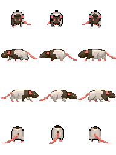
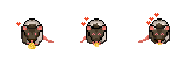
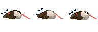
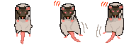
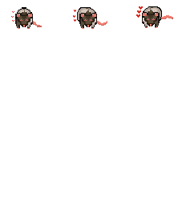

# 🐭 Paco Virtual Desktop Pet

> _"Las mascotas nunca se van del todo, a veces simplemente se transforman en píxeles."_

Un tributo digital interactivo para inmortalizar a Paco. Esta aplicación de escritorio trae de vuelta a la ratita más querida en forma de compañero virtual que vive en tu pantalla, camina sobre tus ventanas y te acompaña mientras usas la PC.

## La Historia

Este proyecto nace como un regalo. La idea es trascender el regalo físico habitual y utilizar la programación para crear algo "vivo". Paco ahora habita en el entorno digital, manteniendo su personalidad curiosa y su amor por el queso.

## ✨ Características Actuales

- **Mascota de Escritorio**: Paco vive en tu pantalla, sobre tus ventanas.
- **Interacción**:
  - **Click Izquierdo**: Dale amor a Paco ❤️ (Animación + Sonido, +5 Affection).
  - **Click Derecho (Menú)**:
    - 🧀 **Dar Quesito**: Aliméntalo (+50 Hambre).
    - 💤 **Mandar a Dormir**: Envíalo a descansar.
    - 📊 **Ver Estadísticas**: Muestra barra de hambre, energía, afecto y nivel.
    - 🔧 **Modo Debug**: Activa/desactiva panel de pruebas.
    - **Despertar**: Si está durmiendo.
  - **Arrastrar**: Muévelo a donde quieras.

- **Sistema de Necesidades (Vitals)**:
  - **Hambre** 🧀: Decae con el tiempo. Aparece una burbuja de pensamiento con emoji de queso cuando tiene hambre (< 30).
  - **Energía** ⚡: Se agota al caminar. Aparece emoji de sueño 💤 cuando está muy cansado (< 20).
  - **Afecto** ❤️: Aumenta al interactuar. Se mantiene estable.
  - **Burbuja de Pensamiento**: Muestra visualmente las necesidades de Paco con el asset `Bubble-tought.png`.

- **Sistema de Progresión**:
  - **Niveles y XP**: Paco gana XP cuando sus stats están altos (promedio > 50%). Los niveles se calculan como `√(XP/100)`.
  - **Persistencia**: Los stats, nivel y XP se guardan automáticamente cada ~1 minuto y al cerrar la app.
  - **Decay Offline**: Cuando reabres la app, el tiempo offline afecta los stats (hambre/energía decaen).

- **Comportamiento**:
  - Camina aleatoriamente, se queda quieto (IDLE), duerme y come.
  - **Estado Crítico**: Si hambre o energía llegan a 0, Paco se mueve a la esquina inferior derecha y se queda quieto esperando ayuda.
  - **Sprites Animados**:
    - Walking (3 frames)
    - Eating (3 frames)
    - Sleeping (3 frames)
    - Love (3 frames)
    - Held (3 frames)

### 📸 Galería de Sprites

#### Estados de Paco

**Caminando / Idle**

_Sprite sheet completo - Paco en diferentes estados de movimiento_

**Comiendo Quesito** 🧀

_Paco disfrutando su quesito favorito_

**Durmiendo** 💤

_Paco tomando una siesta_

**Siendo Sostenido**

_Paco cuando lo arrastras_

**Recibiendo Amor** ❤️

_Animación cuando le das clic izquierdo_

## 🛠️ Stack Tecnológico

Este proyecto fue construido utilizando tecnologías web modernas empaquetadas para escritorio:

- **Core:** [Electron.js](https://www.electronjs.org/) (v34+)
- **Lógica (Brain):** Vanilla JavaScript (Node.js integration).
- **Renderizado:** HTML5 + CSS3 Animations.
- **Arte:** Pixel Art customizado (Krita).
- **Arquitectura:**
  - `Main Process`: Manejo de ventana, transparencia y eventos del sistema (Tray).
  - `Renderer Process`: Motor de estados (`PetBrain.js`), sistemas de vitals, niveles y persistencia.

## 📝 Roadmap & Ideas Futuras

- [x] **Persistencia:** Paco recuerda sus stats y nivel entre sesiones.
- [x] **Needs System:** Hambre, energía y afecto implementados.
- [x] **Drag & drop:** Reubicar a Paco arrastrándolo.
- [x] **Sound FX:** Soniditos de squeak aleatorios.
- [x] **Level System:** Sistema de progresión con XP y niveles.
- [ ] **Desktop Interaction:** Que pueda "sentarse" sobre la barra de tareas.
- [ ] **Más Animaciones:** Estados adicionales (asustado, feliz extremo, etc.).
- [ ] **Mini-Juegos:** Interacciones especiales al alcanzar ciertos niveles.
